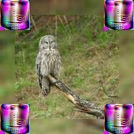
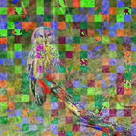
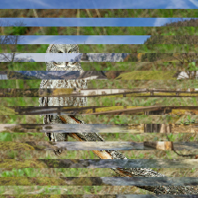
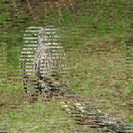
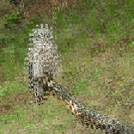
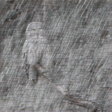

# Image Obfuscation Benchmark

This repository contains the code to evaluate models on the image obfuscation benchmark, first presented in
[Benchmarking Robustness to Adversarial Image Obfuscations](https://arxiv.org/abs/2301.12993)
(Stimberg et al., 2023).

## Dataset

The dataset consists of 22 obfuscations and the Clean data. 19 obfuscations are training obfuscations and 3 are hold-out obfuscations. All images are central cropped to 224 x 224 and saved as compressed JPEG images. Each obfuscation is applied to each image in the [ILSVRC2012](https://www.image-net.org/challenges/LSVRC/2012/) dataset. For each image, the file_name, label and obfuscation hyper-parameters are stored with it. The dataset can be loaded through the [TensorFlow datasets](https://www.tensorflow.org/datasets) API. Each combination of `train` / `validation` and an obfuscation is its own split, e.g. to load the validation split obfuscated with the `StyleTransfer` obfuscation do

```python
import tensorflow_datasets as tfds

ds = tfds.load('obfuscated_imagenet', split='validation_StyleTransfer', data_dir='/path/to/extracted/dataset/')
```

where the splits must be present in the `/path/to/extracted/dataset/obfuscated_imagenet/1.0.0` directory.

To load multiple obfuscations together, e.g. for training use the [`sample_from_datasets`](https://www.tensorflow.org/api_docs/python/tf/data/Dataset#sample_from_datasets) function.

### Obfuscation Examples

Clean|AdversarialPatches|BackgroundBlurComposition|
-----|------------------|------------------------|
||

ColorNoiseBlocks|ColorPatternOverlay|Halftoning|
----------------|-------------------|----------|
||

HighContrastBorder|IconOverlay|ImageOverlay|
------------------|-----------|------------|
||

Interleave|InvertLines|LineShift|
----------|-----------|---------|
||

LowContrastTriangles|PerspectiveComposition|PerspectiveTransform|
--------------------|----------------------|--------------------|
||

PhotoComposition|RotateBlocks|RotateImage|
----------------|------------|-----------|
||

StyleTransfer|SwirlWarp|TextOverlay|
-------------|---------|-----------|
||

Texturize|WavyColorWarp|
---------|-------------|
|

### Download {#dataset-download}

You can download the validation and train splits for all the obfuscations below. If you want to load them with the Tensorflow datasets API as described above you also need to download these two JSON files: [dataset_info.json](https://storage.googleapis.com/dm_image_obfuscation_benchmark/dataset_info.json), [features.json](https://storage.googleapis.com/dm_image_obfuscation_benchmark/features.json).

| Obfuscation               | Validation  |       Train |
| ------------------------- | ----------- | ----------- |
| Clean                     | [tar](https://storage.googleapis.com/dm_image_obfuscation_benchmark/validation_Clean.tar) (1.2 GB) | [tar](https://storage.googleapis.com/dm_image_obfuscation_benchmark/train_Clean.tar) (31 GB) |
| AdversarialPatches        | [tar](https://storage.googleapis.com/dm_image_obfuscation_benchmark/validation_AdversarialPatches.tar) (1.4 GB) | [tar](https://storage.googleapis.com/dm_image_obfuscation_benchmark/train_AdversarialPatches.tar) ( 36 GB) |
| BackgroundBlurComposition | [tar](https://storage.googleapis.com/dm_image_obfuscation_benchmark/validation_BackgroundBlurComposition.tar) ( 0.5 GB) | [tar](https://storage.googleapis.com/dm_image_obfuscation_benchmark/train_BackgroundBlurComposition.tar) (12 GB) |
| ColorNoiseBlocks          | [tar](https://storage.googleapis.com/dm_image_obfuscation_benchmark/validation_ColorNoiseBlocks.tar) (1.9 GB) | [tar](https://storage.googleapis.com/dm_image_obfuscation_benchmark/train_ColorNoiseBlocks.tar) (48 GB) |
| ColorPatternOverlay       | [tar](https://storage.googleapis.com/dm_image_obfuscation_benchmark/validation_ColorPatternOverlay.tar) (1.8 GB) | [tar](https://storage.googleapis.com/dm_image_obfuscation_benchmark/train_ColorPatternOverlay.tar) (45 GB) |
| Halftoning                | [tar](https://storage.googleapis.com/dm_image_obfuscation_benchmark/validation_Halftoning.tar) (2.4 GB) | [tar](https://storage.googleapis.com/dm_image_obfuscation_benchmark/train_Halftoning.tar) (54 GB) |
| HighContrastBorder        | [tar](https://storage.googleapis.com/dm_image_obfuscation_benchmark/validation_HighContrastBorder.tar) (2.1 GB) | [tar](https://storage.googleapis.com/dm_image_obfuscation_benchmark/train_HighContrastBorder.tar) (55 GB) |
| IconOverlay               | [tar](https://storage.googleapis.com/dm_image_obfuscation_benchmark/validation_IconOverlay.tar) (1.7 GB) | [tar](https://storage.googleapis.com/dm_image_obfuscation_benchmark/train_IconOverlay.tar) (43 GB) |
| ImageOverlay              | [tar](https://storage.googleapis.com/dm_image_obfuscation_benchmark/validation_ImageOverlay.tar) (1.2 GB) | [tar](https://storage.googleapis.com/dm_image_obfuscation_benchmark/train_ImageOverlay.tar) (30 GB) |
| Interleave                | [tar](https://storage.googleapis.com/dm_image_obfuscation_benchmark/validation_Interleave.tar) (1.5 GB) | [tar](https://storage.googleapis.com/dm_image_obfuscation_benchmark/train_Interleave.tar) (38 GB) |
| InvertLines               | [tar](https://storage.googleapis.com/dm_image_obfuscation_benchmark/validation_InvertLines.tar) (1.4 GB) | [tar](https://storage.googleapis.com/dm_image_obfuscation_benchmark/train_InvertLines.tar) (35 GB) |
| LineShift                 | [tar](https://storage.googleapis.com/dm_image_obfuscation_benchmark/validation_LineShift.tar) (1.5 GB) | [tar](https://storage.googleapis.com/dm_image_obfuscation_benchmark/train_LineShift.tar) (37 GB) |
| LowContrastTriangles      | [tar](https://storage.googleapis.com/dm_image_obfuscation_benchmark/validation_LowContrastTriangles.tar) (0.9 GB) | [tar](https://storage.googleapis.com/dm_image_obfuscation_benchmark/train_LowContrastTriangles.tar) (23 GB) |
| PerspectiveComposition    | [tar](https://storage.googleapis.com/dm_image_obfuscation_benchmark/validation_PerspectiveComposition.tar) (1.1 GB) | [tar](https://storage.googleapis.com/dm_image_obfuscation_benchmark/train_PerspectiveComposition.tar) (29 GB) |
| PerspectiveTransform      | [tar](https://storage.googleapis.com/dm_image_obfuscation_benchmark/validation_PerspectiveTransform.tar) (0.4 GB) | [tar](https://storage.googleapis.com/dm_image_obfuscation_benchmark/train_PerspectiveTransform.tar) (9.5 GB) |
| PhotoComposition          | [tar](https://storage.googleapis.com/dm_image_obfuscation_benchmark/validation_PhotoComposition.tar) (1.2 GB) | [tar](https://storage.googleapis.com/dm_image_obfuscation_benchmark/train_PhotoComposition.tar) (31 GB) |
| RotateBlocks              | [tar](https://storage.googleapis.com/dm_image_obfuscation_benchmark/validation_RotateBlocks.tar) (1.5 GB) | [tar](https://storage.googleapis.com/dm_image_obfuscation_benchmark/train_RotateBlocks.tar) (37 GB) |
| RotateImage               | [tar](https://storage.googleapis.com/dm_image_obfuscation_benchmark/validation_RotateImage.tar) (1.0 GB) | [tar](https://storage.googleapis.com/dm_image_obfuscation_benchmark/train_RotateImage.tar) (24 GB) |
| StyleTransfer             | [tar](https://storage.googleapis.com/dm_image_obfuscation_benchmark/validation_StyleTransfer.tar) (1.3 GB) | [tar](https://storage.googleapis.com/dm_image_obfuscation_benchmark/train_StyleTransfer.tar) (34 GB) |
| SwirlWarp                 | [tar](https://storage.googleapis.com/dm_image_obfuscation_benchmark/validation_SwirlWarp.tar) (1.2 GB) | [tar](https://storage.googleapis.com/dm_image_obfuscation_benchmark/train_SwirlWarp.tar) (29 GB) |
| TextOverlay               | [tar](https://storage.googleapis.com/dm_image_obfuscation_benchmark/validation_TextOverlay.tar) (2.1 GB) | [tar](https://storage.googleapis.com/dm_image_obfuscation_benchmark/train_TextOverlay.tar) (55 GB) |
| Texturize                 | [tar](https://storage.googleapis.com/dm_image_obfuscation_benchmark/validation_Texturize.tar) (1.3 GB) | [tar](https://storage.googleapis.com/dm_image_obfuscation_benchmark/train_Texturize.tar) (34 GB) |
| WavyColorWarp             | [tar](https://storage.googleapis.com/dm_image_obfuscation_benchmark/validation_WavyColorWarp.tar) (1.3 GB) | [tar](https://storage.googleapis.com/dm_image_obfuscation_benchmark/train_WavyColorWarp.tar) (33 GB) |


## Usage Instructions

### Installing

Download the [eval dataset](#dataset-download) and extract it to a folder.

Clone this repository.

```
git clone https://github.com/deepmind/image_obfuscation_benchmark.git
```

Execute `run.sh` to create and activate a virtualenv, install all necessary
dependencies and run a test program to ensure that you can import all the
modules.

```shell
cd image_obfuscation_benchmark
sh image_obfuscation_benchmark/run.sh
```

### Evaluating a model

```
source /tmp/image_obfuscation_benchmark/image_obfuscation_benchmark/bin/activate
```

and then run

```shell
python3 -m image_obfuscation_benchmark.eval.predict \
--dataset_path=/path/to/the/downloaded/dataset/ \
--model_path=https://tfhub.dev/google/imagenet/resnet_v2_50/classification/1 \
--evaluate_obfuscation=Clean \
--normalization=zero_one \
--output_dir=/tmp/
```

Which will write predictions to `/tmp/Clean.csv`. This has to be done for all
obfuscations. Afterwards you run

```shell
python3 -m image_obfuscation_benchmark.eval.gather_results \
--output_dir=/tmp/
```

which will load all the predictions, calculate the metrics and save them to
`/tmp/metrics.csv`.

### Training a model

We do not supply code to train models on the dataset at the moment but it can be
easily loaded with [tensorflow_datasets](https://github.com/tensorflow/datasets) into any pipeline.

## Ethical Considerations
The specific obfuscations that we use in our benchmark may have the potential to fool automatic filters and therefore increase the amount of harmful con￾tent on digital platforms. To reduce this risk, we decided against releasing the code to create the obfuscations systematically and instead only releasing the precomputed
dataset and code to evaluate on it.

## Citing this work

If you use this code (or any derived code) in your work, please cite the [accompanying paper](https://arxiv.org/abs/2301.12993):

```
@misc{stimberg2023benchmarking,
      title={Benchmarking Robustness to Adversarial Image Obfuscations},
      author={Florian Stimberg and Ayan Chakrabarti and Chun-Ta Lu and Hussein Hazimeh and Otilia Stretcu and Wei Qiao and Yintao Liu and Merve Kaya and Cyrus Rashtchian and Ariel Fuxman and Mehmet Tek and Sven Gowal},
      year={2023},
      eprint={2301.12993},
      archivePrefix={arXiv},
}
```

## License and Disclaimer

Copyright 2023 DeepMind Technologies Limited.

All software is licensed under the Apache License, Version 2.0 (Apache 2.0);
you may not use this file except in compliance with the License. You may obtain
a copy of the Apache 2.0 license at

[https://www.apache.org/licenses/LICENSE-2.0](https://www.apache.org/licenses/LICENSE-2.0)

All non-code materials are licensed under the Creative Commons Attribution-NonCommercial 4.0 International (CC BY-NC 4.0). You may obtain a copy of the CC BY-NC License at:

[https://creativecommons.org/licenses/by-nc/4.0/legalcode](https://creativecommons.org/licenses/by-nc/4.0/legalcode)

You may not use the non-code portions of this file except in compliance with the CC BY-NC License.

Unless required by applicable law or agreed to in writing, software distributed
under the License is distributed on an "AS IS" BASIS, WITHOUT WARRANTIES OR
CONDITIONS OF ANY KIND, either express or implied. See the License for the
specific language governing permissions and limitations under the License.

This is not an official Google product.